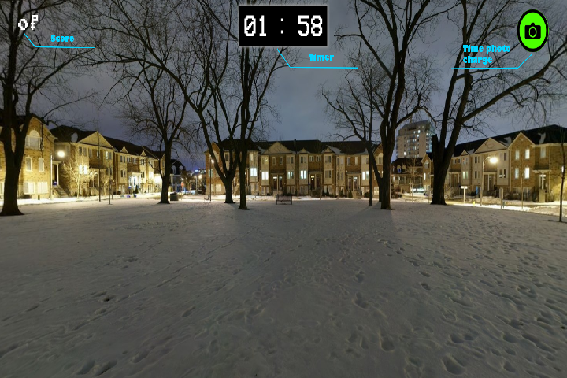
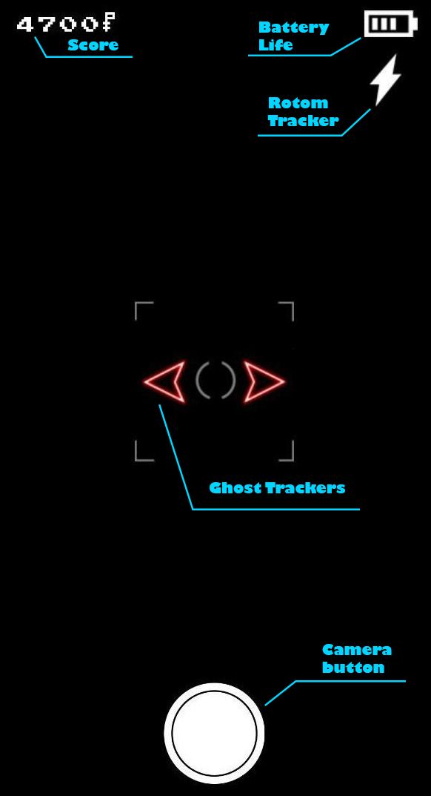

# PokéBusters: I ain't afraid of no ghost-type

Questo gioco per web è stato realizzato per il final del corso di Programmazione Interfacce nell'a.a. 18/19. 
Tale gioco è stato realizzato per essere giocato in realtà aumentata con un dispositivo mobile supportato. 

## Scopo del gioco
Lo scopo del gioco è semplice: scatta più foto possibili ai Pokémon di tipo Spettro che appaiono nella tua stanza entro il tempo limite.
Il tempo limite è rappresentato dalla durata della batteria, se la batteria arriva allo 0% il gioco finisce.

## Come giocare
Ci sono due versioni di gioco: **desktop** e **mobile**.
La prima, ovviamente, è pensata per essere giocata esclusivamente sul PC. Per muoversi intorno all'area basta usare il **mouse/touchpad** e premere il suo **tasto sinistro** permette di scattare una foto.

Invece la seconda versione è stata realizzata per essere giocata esclusivamente su smartphone/tablet supportati e provvisti di giroscopio. Infatti, per muovere la camera c'è bisogno di un giroscopio, infine, per scattare una foto basta cliccare il bottone virtuale bianco. 

## Punteggio
Breve guida ai Pokémon presenti con il relativo punteggio:
- **Gastly**: 100 ★
- **Haunter**: 300 ★
- **Gengar**: 500 ★
- **Rotom**: 40 secondi in più al timer ★
- **Pumpkaboo**: Dimezza il punteggio
- **Hoopa**: 10000

La versione cromatica (★) raddoppia il singolo punteggio del corrispettivo Pokémon quando viene fotografato, tranne per Rotom che la sua versione cromatica aggiunge 60 secondi in più al timer. 
Hoopa è veramente raro da immortalare e può essere fotografato una sola volta. Egli potrebbe apparire quando si raggiunge un punteggio molto alto.

## Dove giocare
Per poter giocare a questo gioco potete provarlo su [questo sito](https://pokebustersproject.herokuapp.com/). Esso contiene entrambe le versioni.
É consigliato giocare su Chrome oppure Firefox per una maggior qualità e compabilità. 
Su un sistema IOS potrebbe esserci problemi di incompatibilità, invece su Android non si è riscontrato nessun problema. 

**N.B** Se su IOS il giroscopio non funziona bisogna controllare che i permessi siano stati attivati: 
        Settings > Safari > Enable the motion/orientation access setting 

*Credit to Nintendo, The Pokémon Company, Game Freak Inc. and Creatures Inc.*
